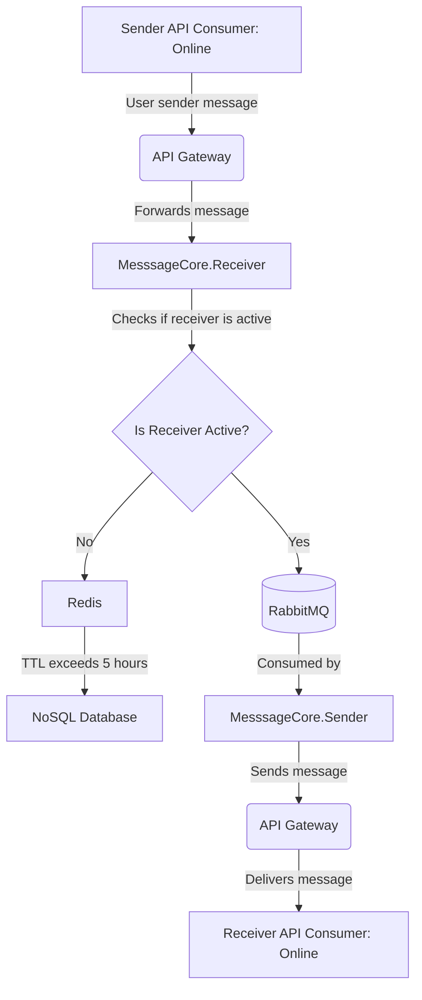

# Klik-Core

High level architecture and requirements

Not all cases are covered for now

# Message Flow Diagram

## Sender send a massage and receiver is online at the time of sending message 

### flow:

* User sends message
* Api gateway route it to Message Handler microservice
* Message Handler check if user is online (in this case it is)
* send message to rabbitmq
* Microservice "Message Sender" Consume message
* Message is ack if Receiver API get message otherwise retry, (case when he log in for second and be unavaialbe again for few hours is not covered) we need to implement dead queue letter automation or move later to kafka

## Sender send a massage and receiver is offline at the time of sending message but shorter tha reddis TTL (for now 24 hours)

* User sends message
* Api gateway route it to Message Handler microservice
* Message Handler check if user is online (in this case it is not)
* Save message to redis
* Worker checks if users messages that are stored in redis are active now
* If user is active then message is send to rabbitmq
* Microservice "Message Sender" Consume message
* Message is ack if Receiver API get message otherwise retry, (case when he log in for second and be unavaialbe again for few hours is not covered) we need to implement dead queue letter automation or move later to kafka

