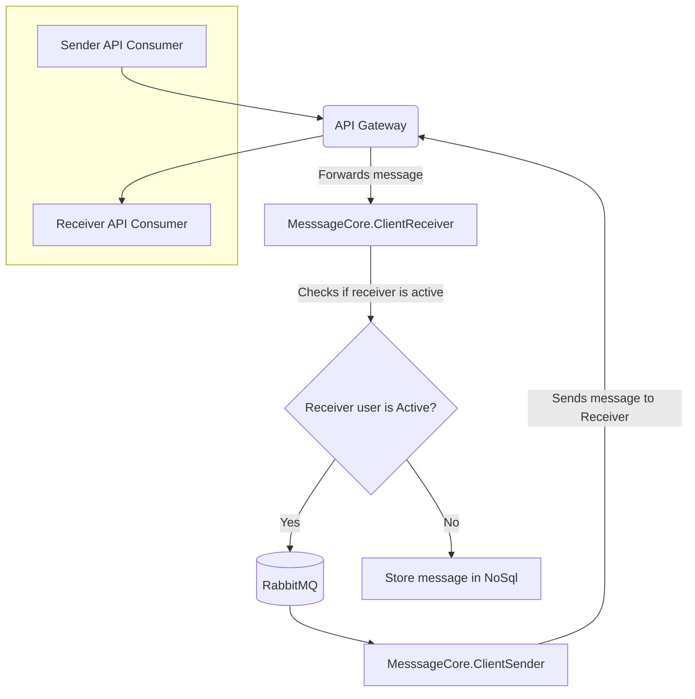
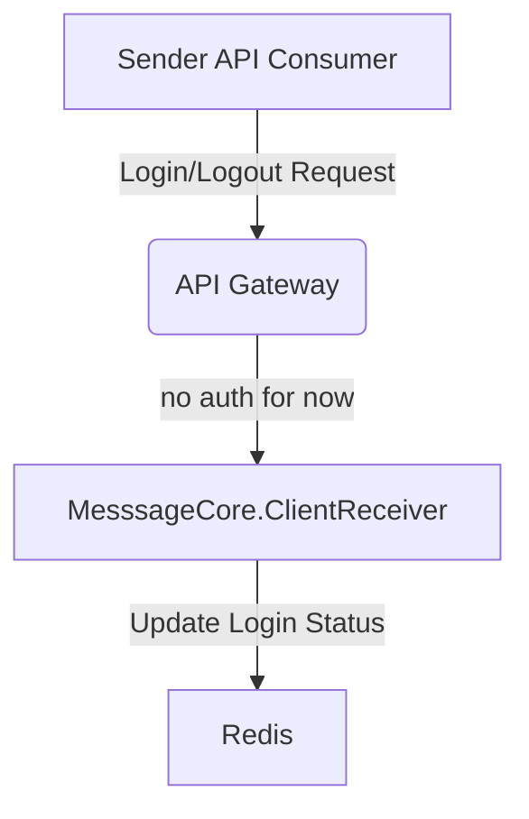
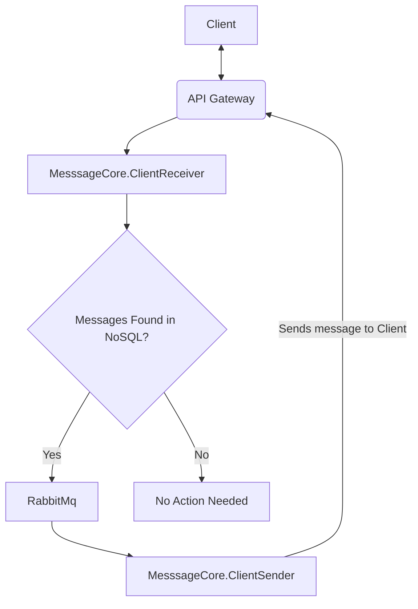

# High level architecture

## Message Flow Diagram

### Sender send a massage and receiver is online at the time of sending message 

* User sends message
* Api gateway route it to Message Handler microservice
* Message Handler check if user is online (in this case it is)
* send message to rabbitmq
* Microservice "Message Sender" Consume message
* Message is ack if Receiver API get message otherwise retry, (case when he log in for second and be unavaialbe again for few hours is not covered) we need to implement dead queue letter automation or move later to kafka

### Sender send a massage and receiver is offline at the time of sending message

* User sends message
* Api gateway route it to Message Handler microservice
* Message Handler check if user is online (in this case it is not)
* Save message to nosql

## Keeping track of users active status

### User logged in
* Microservice "MesssageCore.ClientReceiver" update user status in redis to "active"

### User logged out
* Microservice "MesssageCore.ClientReceiver" update user status in redis to "not active"

## Send undelivered messages

